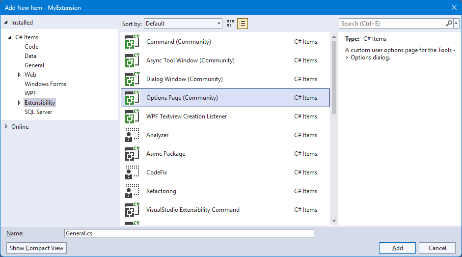
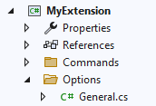
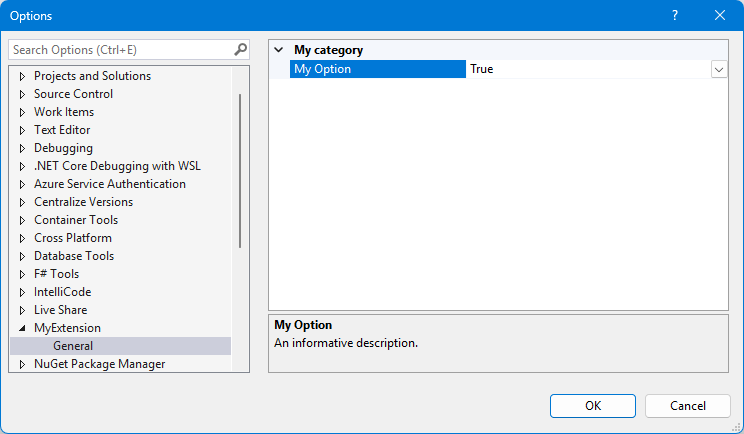
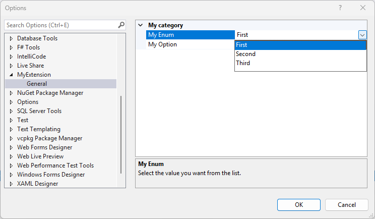
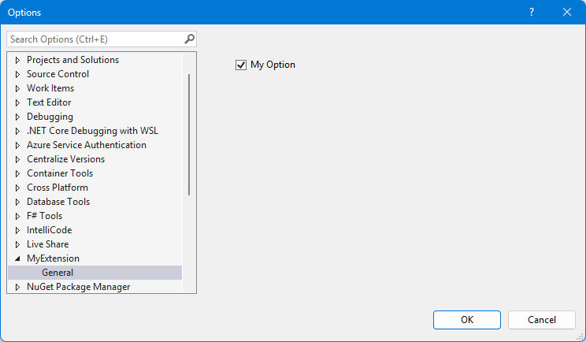

Storing and retrieving settings is a must-have for many extensions. Let's explore how to work with settings with these goals in mind:

* A simple way to provide custom options
* Expose the options in the Tools -> Options dialog
* Thread-safe way to access and modify the settings
* Both synchronous and asynchronous support
* No need to load the package for the settings to initialize

<div class="video-container">
<iframe src="https://www.youtube-nocookie.com/embed/1ysOqnaiz1o?list=PLReL099Y5nRdz9jvxuy_LgHFKowkx8tS4&color=white" title="YouTube video player" allowfullscreen></iframe>
</div>

Here's what it should look like in the **Tools -> Options** dialog.

## [Add an Options page](#add-an-options-page)
Right-click your project and select **Add -> New Item...** to show the available templates. Then select the **Extensibility** category on the left side and then **Options Page (Community)** template. In the name field below, write **General**.



This will create */Options/General.cs* in the root of the project.



Here's the content of the General.cs file:

```csharp
internal partial class OptionsProvider
{
    // Register the options with this attribute on your package class:
    // [ProvideOptionPage(typeof(OptionsProvider.GeneralOptions), "MyExtension", "General", 0, 0, true, SupportsProfiles = true)]
    [ComVisible(true)]
    public class GeneralOptions : BaseOptionPage<General> { }
}

public class General : BaseOptionModel<General>
{
    [Category("My category")]
    [DisplayName("My Option")]
    [Description("An informative description.")]
    [DefaultValue(true)]
    public bool MyOption { get; set; } = true;
}
```

It's short and simple and we'll go over the details. But first, we must register the Options page.

## [Register the Options page](#register-the-options-page)
In a code comment in the *General.cs* file are instructions how to register the Options page.

All we have to do is to copy the `ProvideOptionsPage` attribute into our Package class. That might look something like this:

```csharp
[ProvideOptionPage(typeof(OptionsProvider.GeneralOptions), "MyExtension", "General", 0, 0, true, SupportsProfiles = true)]
public sealed class OptionsPackage : ToolkitPackage
{
    ...
}
```

Running the extension, we should now see the **MyExtension/General** options page showing up in the **Tools -> Options** dialog.



The `ProvideOptionsPage` attribute is what makes the Options page show up in the **Tools -> Options** dialog. You can omit this attribute if you don't want the options page visible to your users.
The `SupportsProfiles` flag on this attribute  registers the options on the roaming profile, which means the individual settings will roam with the user's account across instances and installs of Visual Studio. It also enables the import/export settings feature of Visual Studio. This attribute is optional.

## [The individual options](#the-individual-options)
In the General.cs file, you can see how individual options are nothing more than simple C# properties decorated with attributes.

```csharp
    [Category("My category")]
    [DisplayName("My Option")]
    [Description("An informative description.")]
    [DefaultValue(true)]
    public bool MyOption { get; set; } = true;
```

Simple data types such as `string`, `bool`, `int`, are all supported out of the box and that covers most use cases. For other data types we must use type converters. Some are built in to Visual Studio, such as the `EnumConverter`.

Consider this enum:

```csharp
public enum Numbers
{
    First,
    Second,
    Third,
}
```

We can expose those values as options in a dropdown by declaring the `TypeConverter` like so:

```csharp
[Category("My category")]
[DisplayName("My Enum")]
[Description("Select the value you want from the list.")]
[DefaultValue(Numbers.First)]
[TypeConverter(typeof(EnumConverter))]
public Numbers MyEnum { get; set; } = Numbers.First;
```




## [Walkthrough: Create individual Options with Checkboxes](#Walkthrough-Create-individual-Options-with-Checkboxes)


If you want to have individual options display Checkboxes, you have to create a custom option page.
You will still use all the classes you created above but now you must create a WPF UIElementDialogPage.

This WPF page will allow you to take total control of how your option is displayed in Tools Option Menu. We are not limited to just Checkboxes. 

All WPF controls can be used.

- CheckBox
- TextBlock
- TextBox
- RadioButton
- etc.


You will need to create two additional files: A WPF Xaml file that holds your controls and a C# Class that initializes your option page.

The following OptionsProvider code you created above does not change.


```csharp
internal partial class OptionsProvider
{
    // Register the options with this attribute on your package class:
    // [ProvideOptionPage(typeof(OptionsProvider.GeneralOptions), "MyExtension", "General", 0, 0, true, SupportsProfiles = true)]
    [ComVisible(true)]
    public class GeneralOptions : BaseOptionPage<General> { }
}

public class General : BaseOptionModel<General>
{
    [Category("My category")]
    [DisplayName("My Option")]
    [Description("An informative description.")]
    [DefaultValue(true)]
    public bool MyOption { get; set; } = true;
}
```


Now create a new class GeneralOptionPage.cs.

Add two using statements:

```csharp
using System.Runtime.InteropServices;
using WindowsUI = System.Windows;
```

Add the following code to the GeneralOptionPage.cs. 

> Note: Make sure you replace the Guid with a new unique Guid.

```csharp
    [ComVisible(true)]
    [Guid("D8B47497-8AC9-4E2E-9D62-D8E8E7A47AA4")]

    public class GeneralOptionPage : UIElementDialogPage
    {
        protected override WindowsUI.UIElement Child
        {
            get
            {
                GeneralOptions page = new GeneralOptions
                {
                    generalOptionsPage = this
                };
                page.Initialize();
                return page;
            }
        }
    }
```


Now create a new WPF UserControl called GeneralOptions.

Add a WPF CheckBox named cbMyOption to the Grid in the GeneralOptions.xaml file then and add two events, Checked and Unchecked.


```xml
    <Grid>
        <CheckBox x:Name="cbMyOption" Content="My Option" HorizontalAlignment="Left"
                  Margin="30,36,0,0" VerticalAlignment="Top"
                  IsThreeState="False"
                  Checked="cbMyOption_Checked" Unchecked="cbMyOption_Unchecked"/>
    </Grid>
```


In the code behind GeneralOptions.xaml.cs file update or add the following:


```csharp
    public partial class GeneralOptions : UserControl
    {
        public GeneralOptions()
        {
            InitializeComponent();
        }
        internal GeneralOptionPage generalOptionsPage;

        public void Initialize()
        {
            cbMyOption.IsChecked = General.Instance.MyOption;
            General.Instance.Save();
        }

        private void cbMyOption_Checked(object sender, System.Windows.RoutedEventArgs e)
        {
            General.Instance.MyOption = (bool)cbMyOption.IsChecked;
            General.Instance.Save();
        }

        private void cbMyOption_Unchecked(object sender, System.Windows.RoutedEventArgs e)
        {
            General.Instance.MyOption = (bool)cbMyOption.IsChecked;
            General.Instance.Save();
        }
    }
```

Now update your Package class and replace the entry you entered above to the following:

From this:

```csharp
[ProvideOptionPage(typeof(OptionsProvider.GeneralOptions), "MyExtension", "General", 0, 0, true, SupportsProfiles = true)]
```

To this:

```csharp
[ProvideOptionPage(typeof(GeneralOptionPage), "MyExtension", "General", 0, 0, true, SupportsProfiles = true)]
```

Build and debug to the experimental instance of Visual Studio.

You should now see the following when you open your option page.




> Note: Since this is WPF you can add whatever additional UI elements like for e.g. Textboxes, to provide more details about an option.


## [Reading and writing options](#reading-and-writing-options)
Now that you've registered the options to let your users change their values, it's time to read those values to use in our extension.

You can work with settings from both synchronous and asynchronous contexts. Let's start with the synchronous:

```csharp
// read settings
var number = General.Instance.MyEnum;

// write settings
General.Instance.MyEnum = Numbers.Second;
General.Instance.Save();
```

The API for reading and writing to the settings are very simple and straight forward.

When working in an asynchronous context, the API looks very similar.

```csharp
// read settings
var general = await General.GetLiveInstanceAsync();
var number = general.MyEnum;

// write settings
general.MyEnum = Numbers.Second;
await general.SaveAsync();
```

## [Events](#events)
When the settings are saved, the static event `General.Saved` is fired. You can subscribe to that event like any other event in .NET and it looks like this:

```csharp
General.Saved += OnSettingsSaved;

...

private void OnSettingsSaved(object sender, General e)
{
   
}
```

## [Get the source code](#source-code)
You can find the source code for this extension in the [samples repository](https://github.com/VsixCommunity/Samples).

## [Additional resources](#additional-resources)
Read the docs for all the details surrounding these scenarios, but notice that while they do provide more detailed documentation, they don't follow the best practices outlined in this sample. They also don't use the Community Toolkit that makes working with settings so much easier.

* [Creating an Options Page](https://docs.microsoft.com/visualstudio/extensibility/creating-an-options-page)
* [Using the Settings Store](https://docs.microsoft.com/visualstudio/extensibility/using-the-settings-store)
* [Writing to the User Settings Store](https://docs.microsoft.com/en-us/visualstudio/extensibility/writing-to-the-user-settings-store)
